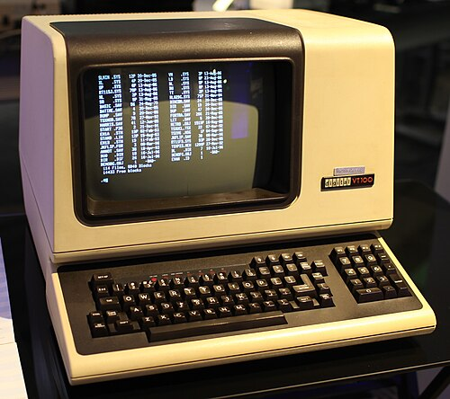
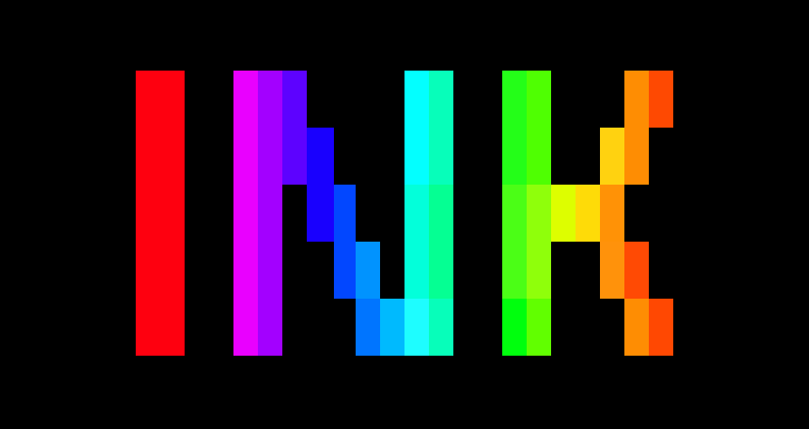
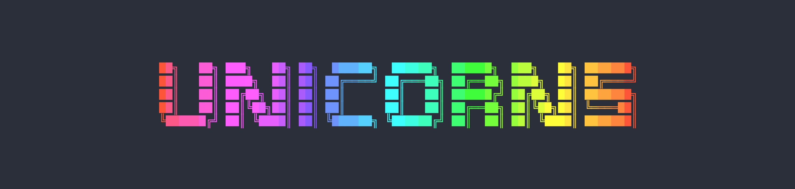
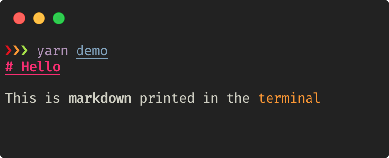
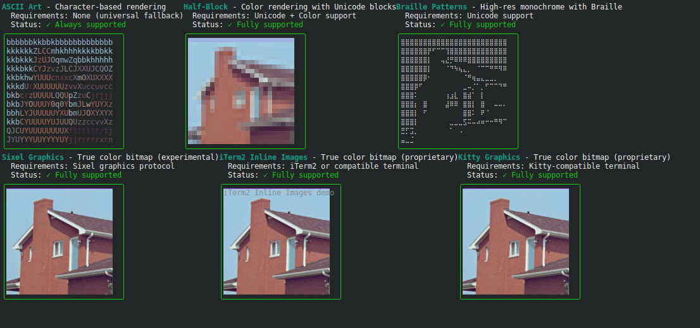
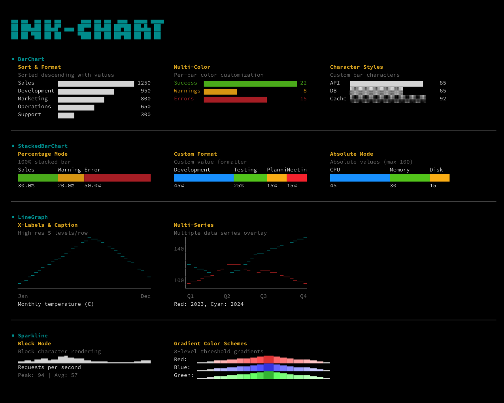

<!--  alignment:  center  -->
<!--  new_lines:  8  -->

```bash +exec_replace  +no_background  +pty:80:15
echo  -ne  "\e[?25l"
figlet  -c  "React  in  Your  Terminal"
```

_Building Beautiful TUIs with Ink_

<!--  new_lines:  3  -->

James Zheng

<!--  end_slide  -->

Who Am I
===

<!--  column_layout:  [1,  2]  -->

<!--  column:  0  -->


<!--  column:  1  -->

<!--  pause  -->

## James Zheng

📚 Incoming CS student

👨‍💻 Hobby OSS contributor

🚀 Building accessibility tools for the visually impaired

<!--  end_slide  -->

The Terminal Renaissance
===

<!--  column_layout:  [1,  1]  -->

<!--  column:  0  -->

## Terminal User Interface (TUI)

> Runs in your terminal or console

- Efficient and lightweight
- Low complexity
- More scriptable
- Cross platform

<!--  pause  -->

<!--  column:  1  -->

<!--  alignment:  center  -->


No bloat!

<!--  end_slide  -->

<!--  alignment:  center  -->
<!--  jump_to_middle  -->

How TUIs Work
===

```bash +exec_replace  +no_background  +pty:3:1
echo  -ne  "\e[?25l"
python3 spinner.py
```

<!--  end_slide  -->

## ANSI escape sequences

<!--  column_layout:  [1,  2]  -->

<!--  column:  0  -->

## VT100



> ANSI sequences were introduced in the 1970s to replace vendor-specific sequences and became widespread in the computer equipment market by the early 1980s. Although hardware text terminals have become increasingly rare in the 21st century, the relevance of the ANSI standard persists because a great majority of terminal emulators and command consoles interpret at least a portion of the ANSI standard.

<!--  column:  1  -->

## ANSI escape sequences

> ANSI escape sequences are a standard for in-band signaling to control cursor location, color, font styling, and other options on video text terminals and terminal emulators.

<!--  new_lines:  3  -->

| ANSI Code Sequence      | Description                          |
| :---------------------- | :----------------------------------- |
| `\033[H`                | moves cursor to home position (0, 0) |
| `\033[{line};{column}H` | moves cursor to line #, column #     |
| `\033[#A`               | moves cursor up # lines              |
| `\033[#B`               | moves cursor down # lines            |
| `\033[#C`               | moves cursor right # columns         |
| `\033[#D`               | moves cursor left # columns          |

```bash +exec  +pty:10:1  {1,4}
printf  "\033[?25l]"
while  true;  do
    for  frame  in  '-'  '\\'  '|'  '/';  do
        printf  "\r\033[2K\033[38;2;238;147;34m${frame}\033[0m"
        sleep  0.5
    done
done
```

<!--  end_slide  -->

Star Wars!
===

<!--  new_lines:  4  -->

```bash +exec_replace  +pty:80:24
telnet  towel.blinkenlights.nl
```

<!--  end_slide  -->

Using Unicode
===

## Box-drawing characters

```bash +exec_replace
node  --import=tsx  scripts/box.tsx
```

<!--  pause  -->

## Block elements

- Full block: `█`
- Left and right halves: `▌▐`
- Top and bottom halves: `▀▄`
- Fractions: `▁▂▃▄▅▆▇█`

<!--  pause  -->

## Braille

```bash +exec_replace  +pty:40:1
printf  "\033[?25l]"
while  true;  do
        for  frame  in  '⠋'  '⠉'  '⠙'  '⠸'  '⠴'  '⠤'  '⠦'  '⠇';  do
                printf  "\r\033[2K${frame}  Loading..."
                sleep  0.1
        done
done
```

<!--  end_slide  -->

<!--  jump_to_middle  -->

Ink
===

```bash +exec_replace  +no_background  +pty:3:1
echo  -ne  "\e[?25l"
uv  run  spinner.py
```

<!--  end_slide  -->

Ink
===



https://github.com/vadimdemedes/ink

🌈 React for interactive command-line apps

⭐ 38.8k

Ink provides the same component-based UI building experience that React offers in the browser, but for command-line apps.

_If you are already familiar with React, you already know Ink._

<!--  new_lines:  2  -->

> I love telling the story how I started Ink. Sindre me were on vacation, on a remote Thai island, drinking heavily at night. Back in 2017, were working together on AVA. AVA has become a complex project and we were tired of joining strings to generate that pretty output that AVA had.
>
> That’s when I pitched Sindre the idea of using React components to make this easier for us and he loved it. The first version of Ink wasn’t actually using React, but instead was a re-implementation of React compatible with the terminal. I didn’t know how to create a custom React reconciler, so I figured what the hell, I’d just create my own React.
>
> — Vadim Demedes

<!--  end_slide  -->

<!--  alignment:  center  -->

<!--  new_lines:  10  -->

<!--  column_layout:  [1,  1,  1]  -->

<!--  column:  0  -->


<!--  column:  1  -->


<!--  column:  2  -->


<!--  reset_layout  -->

<!--  new_lines:  5  -->

<!--  column_layout:  [1,  1,  1]  -->

<!--  column:  0  -->

Claude Code

<!--  column:  1  -->

Gemini CLI

<!--  column:  2  -->

Cloudflare Wrangler

<!--  reset_layout  -->

<!--  new_lines:  3  -->

**All built with Ink.**

<!--  end_slide  -->

Ink Fundamentals
===

<!--  alignment:  center  -->

| Ink component | HTML/React equivalent         |
| ------------- | ----------------------------- |
| `<Box>`       | `<div>` with display:flex     |
| `<Text>`      | Styled text                   |
| `<Static>`    | Persistent output (like logs) |

```bash +exec  +pty
/// cat  -  <<EOF  >  /dev/null
import  React,  {  useState,  useEffect  }  from  "react";
import  {  render,  Text  }  from  "ink";

const  Counter  =  ()  =>  {
    const  [counter,  setCounter]  =  useState(0);

    useEffect(()  =>  {
        const  timer  =  setInterval(()  =>  {
            setCounter((previousCounter)  =>  previousCounter  +  1);
        },  100);

        return  ()  =>  {
            clearInterval(timer);
        };
    },  []);

    return  <Text  color="green">{counter}  tests  passed</Text>;
};

render(<Counter  />);
/// EOF
/// #  the  actual  script
/// npx  tsx  scripts/ink-counter.tsx
```

<!--  end_slide  -->

```tsx {5,  10-15}
import  React  from  'react';
import  {render,  Box,  Text,  useWindowSize}  from  'ink';

function  App()  {
    const  {columns,  rows}  =  useWindowSize();

    setInterval(()  =>  {},  1000);

    return  (
        <Box
            width={columns}
            height={rowsifyContent="center"
            alignItems="center"
            borderStyle="round"
        >
            <Text>Hello  World</Text>
        </Box>
    );
}

render(<App  />,  {
    alternateScreen:  true,
});
```

<!--  end_slide  -->

```tsx {7}
import  React  from  'react';
import  {render,  Box,  Text,  useWindowSize}  from  'ink';

function  App()  {
    const  {columns,  rows}  =  useWindowSize();

    setInterval(()  =>  {},  1000);

    return  (
        <Box
            width={columns}
            height={rowsifyContent="center"
            alignItems="center"
            borderStyle="round"
        >
            <Text>Hello  World</Text>
        </Box>
    );
}

render(<App  />,  {
    alternateScreen:  true,
});
```

<!--  end_slide  -->

```tsx {16}
import  React  from  'react';
import  {render,  Box,  Text,  useWindowSize}  from  'ink';

function  App()  {
    const  {columns,  rows}  =  useWindowSize();

    setInterval(()  =>  {},  1000);

    return  (
        <Box
            width={columns}
            height={rowsifyContent="center"
            alignItems="center"
            borderStyle="round"
        >
            <Text>Hello  World</Text>
        </Box>
    );
}

render(<App  />,  {
    alternateScreen:  true,
});
```

<!--  end_slide  -->

```bash {21-23}
import  React  from  'react';
import  {render,  Box,  Text,  useWindowSize}  from  'ink';

function  App()  {
    const  {columns,  rows}  =  useWindowSize();

    setInterval(()  =>  {},  1000);

    return  (
        <Box
            width={columns}
            height={rowsifyContent="center"
            alignItems="center"
            borderStyle="round"
        >
            <Text>Hello  World</Text>
        </Box>
    );
}

render(<App  />,  {
    alternateScreen:  true,
});
```

<!--  end_slide  -->

```tsx
function TextInput() {
	const [input, setInput] = useState('');

	useInput((input, key) => {
		if (key.backspace) {
			setInput(prevInput => prevInput.slice(0, -1));
		} else if (input) {
			setInput(prevInput => prevInput + input);
		}
	});

	return (
		<Box flexDirection="row" borderStyle="single">
			<Text>Type something: </Text>
			<Text>{input}</Text>
		</Box>
	);
}

render(<TextInput />);
```

<!--  end_slide  -->

```tsx
const  items  =  ['Red',  'Green',  'Blue',  'Yellow',  'Magenta',  'Cyan'];

function  SelectInput()  {
    const  [selectedIndex,  setSelectedIndex]  =  useState(0);
    const  isScreenReaderEnabled  =  useIsScreenReaderEnabled();

    useInput((input,  key)  =>  {
        if  (key.upArrow)  {
            setSelectedIndex(previousIndex  =>
                previousIndex  ===  0  ?  items.length  -  1  :  previousIndex  -  1,
            );
        }

        if  (key.downArrow)  {
            setSelectedIndex(previousIndex  =>
                previousIndex  ===  items.length  -  1  ?  0  :  previousIndex  +  1,
            );
        }
//  ...
```

<!--  end_slide  -->

```tsx
//  ...
        if  (isScreenReaderEnabled)  {
            const  number  =  Number.parseInt(input,  10);
            if  (!Number.isNaN(number)  &&  number  >  0  &&  number  <=  items.length)  {
                setSelectedIndex(number  -  1);
            }
        }
    });
//  ...
```

<!--  end_slide  -->

```tsx
//  ...
    return  (
        <Box  flexDirection="column"  aria-role="list">
            <Text>Select  a  color:</Text>
            {items.map((item,  index)  =>  {
                const  isSelected  =  index  ===  selectedIndex;
                const  label  =  isSelected  ?  `>  ${item}`  :  `    ${item}`;
                const  screenReaderLabel  =  `${index  +  1}.  ${item}`;

                return  (
                  <Box
                    key={item}
                    aria-role="listitem"
                    aria-state={{selected:  isSelected}}
                    aria-label={isScreenReaderEnabled  ?  screenReaderLabel  :  undefined}
                  >
                    <Text  color={isSelected  ?  'blue'  :  undefined}>{label}</Text>
                  </Box>
                );
            })}
        </Box>
    );
}

render(<SelectInput  />);
```

<!--  end_slide  -->

Ink Ecosystem
===

<!--  incremental_lists:  true  -->

- Pastel: Next.js-like framework for building CLIs and TUIs

  🌐 https://github.com/vadimdemedes/pastel

<!--  pause  -->

```
my-cli/
    commands/
    auth/
        login.tsx
        logout.tsx
    start.tsx
```

```bash
my-cli  auth  login
my-cli  auth  logout
my-cli  start
```

<!--  end_slide  -->

Community components
===

<!--  incremental_lists:  true  -->

- ink-text-input

https://github.com/vadimdemedes/ink

- ink-big-text

https://github.com/sindresorhus/ink-big-text



- ink-markdown

https://github.com/cameronhunter/ink-markdown



<!--  end_slide  -->

## ink-picture

https://github.com/endernoke/ink-picture



<!--  end_slide  -->

## ink-chart

https://github.com/pppp606/ink-chart



<!--  end_slide  -->

## ink-testing-library

```tsx
import React from 'react';
import test, {type ExecutionContext} from 'ava';
import {render} from 'ink-testing-library';
import Component from './component.js';

test('foo', async (t: ExecutionContext) => {
	const {lastFrame, stdin, unmount} = render(<Component />);

	await delay(100);

	let output = lastFrame()?.trim();
	t.truthy(output, 'Frame  should  render');
	t.true(output === '╭───╮\n' + '|foo│\n' + '╰───╯');

	//  Simulate  pressing  return
	stddin.write('\r');

	await delay(100);

	output = lastFrame()?.trim();
	t.truthy(output, 'Frame  should  render');
	t.true(output!.includes('text'));
});
```

<!--  end_slide  -->

<!--  jump_to_middle  -->

Instagram CLI
===

```bash +exec_replace  +no_background  +pty:3:1
echo  -ne  "\e[?25l"
python3 spinner.py
```

<!--  end_slide  -->

# Instagram CLI

https://github.com/supreme-gg-gg/instagram-cli

> Instagram's (unofficial) CLI and TUI client -- The ultimate weapon against brainrot

Started as Python curses prototype in 1 week. Rewrote to TypeScript + Ink:

<!--  incremental_lists:  true  -->

<!-- list_item_newlines: 2 -->

- modern UI
- better maintainability
- more contributors
- vibe coding

<!--  end_slide  -->

# Features

- Command entry pointss via Pastel

🧑‍💻 TUI for humans

🤖 CLI commands for agents

🧵 Scrolling chat view

⚡ Chat commands

🖼️ Images in terminal

🖱️ Mouse support

> My humble promo

<!--  end_slide  -->

# End

```bash +exec_replace  +no_background  +pty:80:7
echo  -ne  "\e[?25l"
figlet  -c  "Thank  You!"
```

<!--  new_lines:  1  -->

<!--  column_layout:  [2,  3]  -->

<!--  column:  0  -->

## Ink

https://github.com/vadimdemedes/ink

```bash +exec_replace  +no_background
qrrs  -i  "https://github.com/vadimdemedes/ink"
```

<!--  column:  1  -->

## Reach out

✉️ Email: endernoke@gmail.com

⭐ GitHub: @endernoke

𝕏 X: @endernoke

🎮 Discord: @endernoke

🤝 LinkedIn: in/james-zheng-zi
